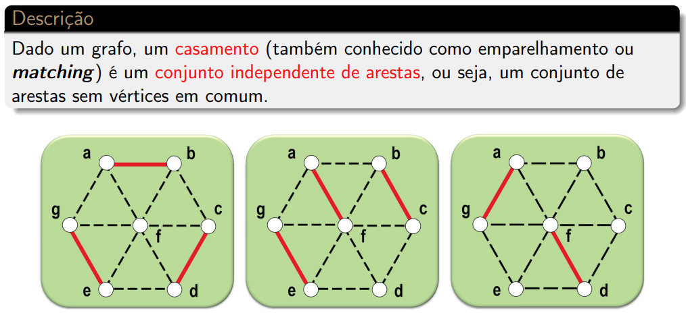
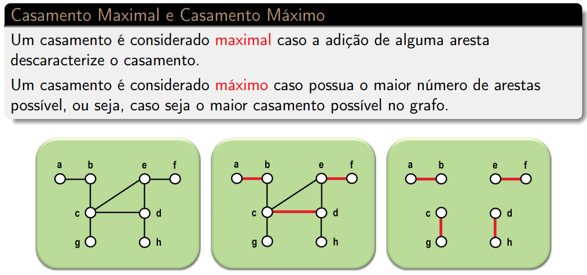
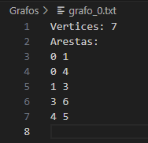
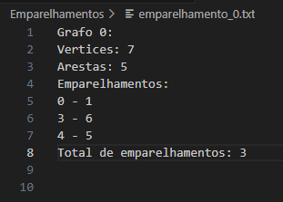
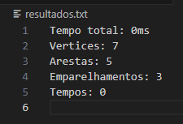
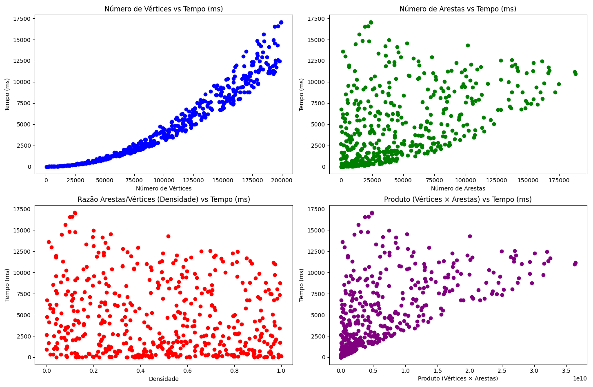

<!--Hércules Aparecido Teixeira - 18.2.8072-->

# Problema do Casamento Máximo em Grafos

## Para rodar o código:
```bash
make run
```

## O problema

Dado um grafo G = (V, E), determinar o maior subconjunto de aresta, E′ ⊆ E, que formam um casamento. <br>Ou seja, nenhum aresta de E′ compartilham vértices em comum;





## Estrutura de arquivos

```bash
projeto/
│
├── bin/
│   ├── GeradorDeInstancias
│   └── AlgoritmoDeBlossom
│
├── src/
│   ├── GeradorDeInstancias.cpp
│   └── AlgoritmoDeBlossom.cpp
│
├── Grafos/
│   ├── grafos_0.txt
│   ├── grafos_1.txt
│   ├   ...
│   └── grafos_n.txt
│
├── Emaprelhamentos/
│   ├── emparelhamento_0.txt
│   ├── emparelhamento_1.txt
│   ├   ...
│   └── emparelhamento_n.txt
│
├── resultados.txt
└── Makefile
```

## Detalhes sobre o tamanho dos grafos

Devido a limitações de memória, estamos adotando grafos com uma quantidade equilibrada de vértices e arestas. Isso significa que, para um grafo com n vértices, geramos n arestas. Essa abordagem garante que o algoritmo possa ser executado de forma eficiente sem exceder os recursos disponíveis.

## Exemplos




## Resultados

